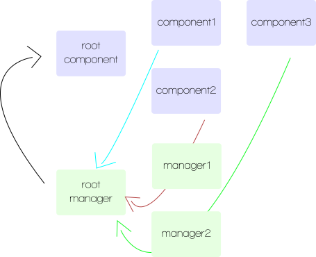

# Dumbux

Dumbux is meant to be a compromise between keeping your architecture super simple and taking advantage of the flux pattern.

It is meant for those who indeed want to avoid passing callbacks all along in their components and make sure the data flows always in the same direction, without bothering adding many more concepts - dispatcher, data store, action creators, you name it.

Dumbux is a data manager. This means it's responsible for retrieving, storing and manipulating data. Basically, you take all your event callbacks and data manipulation methods out of your components to only keep the rendering logic. You call methods from the data manager to manipulate data. Dumbux then pass the new up to date state to your root component.


## Install

```
npm install dumbux
```

If you're using a package.json file, add as dependency:

```
"dumbux": "1.0.0"
```

Dumbux use the es6 style import syntax, so you can load it both those ways:

```javascript
import DataManager from "dumbux";
```

or:

```javascript
var DataManager = require( 'dumbux' ).default;
```

> Note: A es5 compatible browser is expected. If you target non es5 browsers (that is, ie8), use [es5-shim](https://github.com/es-shims/es5-shim).


## Basic usage

You first write your Dumbux data manager and make it global for the current page. The point of the data manager is to be the single point of interaction for data manipulation. You may be worry about this, but you'll see later that data managers are composable (just like components), in case you have complexe needs.

```javascript
import DataManager from "dumbux";

class MainManager extends DataManager {
  getInitialState(){
    return { email: this.props.email || '', password: this.props.password || '', loggedIn: this.props.loggedIn };
  }

  emailChanged( event ){
    this.setState({ name: event.target.value });
  }

  passwordChanged( event ){
    this.setState({ password: event.target.value });
  }

  login( event ){
    event.preventDefault();

    let formData = new FormData();
    formData.append( 'user[email]', this.state.email );
    formData.append( 'user[password]', this.state.password );

    fetch( '/login', { method: 'post', crendentials: 'include', body: formData }).then( ( resp ) => {
      resp.json().then( ( resp ) => this.setState( resp  ));
    });
  }
}

global.manager = new MainManager( initialProperties );
```

You can now write your components and just call `manager.METHOD` where you need it:

```jsx
class RootComponent extends React.Component {
  constructor( props ){
    super( props );
    this.state = manager.state; // set the initial state from manager
  }

  componentDidMount(){
    // subscribe to manager state change
    manager.subscribe( ( newState ) => this.setState( newState ) );
  }

  content(){
    return this.state.loggedIn ? <Welcome /> : <Login {...this.state} />;
  }

  render(){
    return (
      <div>
        {this.content()}
      </div>
    );
  }
}

class Welcome extends React.Component {
  render(){
    return (
      <p>You're logged in, welcome!</p>
    );
  }
}

class Login extends React.Component {
  render(){
    return (
      <form onSubmit={manager.login.bind( manager )}>
        <EmailField value={this.props.email} />
        <PasswordField value={this.props.password} />
        <input type="submit" value="Log in" />
      </form>
    );
  }
}

class EmailField extends React.Component {
  render(){
    return (
      <div>
        <label>Email</label>
        <input onChange={manager.emailChanged.bind( manager )} value={this.props.value} type="email" />
      </div>
    );
  }
}

class PasswordField extends React.Component {
  render(){
    return (
      <div>
        <label>Password</label>
        <input onChange={manager.passwordChanged.bind( manager )} value={this.props.value} type="password" />
      </div>
    );
  }
}
```

No more passing root component callbacks around. No more logic bloated components. Still conceptually simple code. Yay.


## Submanagers

Ok, this looks nice for such a small example, but taking logic out of *all* your components to put them in a single data manager feels like it would quickly get tedious, right?

To prevent that, Dumbux data managers are composable, just like React components:

```javascript
class MainManager extends DataManager {
  getSubManagers(){
    return {
      articles:   ArticlesManager,
      newArticle: NewArticleManager,
    };
  }

  getInitialState(){
    return { loggedIn: this.props.loggedIn };
  }

  addArticle( article ){
    let articles = [ article ].concat( this.state.articles.items );
    this.setState({ articles: { items: articles }, newArticle: { title: '', content: '' });
  }
}

class ArticlesManager extends DataManager {
  getInitialState(){
    return { items: this.props.items, page: this.props.page };
  }

  changePage( page ){
    fetch( `/articles?page=${page}` ).then( ( resp ) => {
      resp.json().then( ( resp ) => this.setState({ items: resp.articles, page: resp.page }) );
    });
  }
}

class NewArticleManager extends DataManager {
  getInitialState(){
    return { title: this.props.title || '', content: this.props.content || '' };
  }

  titleChanged( event ){
    this.setState({ title: event.target.value });
  }

  contentChanged( event ){
    this.setState({ content: event.target.value });
  }

  submit( event ){
    event.preventDefault();
    let formData = new FormData();
    formData.append( 'article[title]', this.state.title );
    formData.append( 'article[content]', this.state.content );

    fetch( '/articles', { method: 'post', credentials: 'include', body: formData }).then( ( resp ) => {
      resp.json().then( ( resp ) => {
        this.root.addArticle( resp.article );
      });
    });
  }
}
```

This may looks like a lot of code to digest, but this is meant to work the most intuitively possible. Let's take it step by step.

First, when you initialize your manager with your initial properties, it automatically delegates them to the responsible submanager. So doing this:

```javascript
global.manager = new MainManager({ loggedIn: true, articles: { items: articles, page: 1 }});
```

will automatically pass the articles object as properties to ArticlesManager instance, allowing it to access them as `this.props` in its `getInitialState` method.

Then, the states are automatically merged for outside access. So you will have something like this:

```javascript
console.log( manager.state );
// => { loggedIn: true, articles: { items: [...], page: 1 }, newArticle: { title: '', content: '' }}
```

This allows you to simply access the state from your root React component, without having to bother about who manages what.

Next thing to note is that you can call any manager method directly (eg: `<form onSubmit={manager.newArticle.submit.bind( manager.newArticle )}>`), and any manager can call `this.setState`.

You can simply call `setState` and it will do what you expect: redraw the interface from the root component. Under the hood, the state bubble up to root manager, which in turn updates the root component. As a result, we have this simple flux implementation:



Finally, you may also have noticed how the `submit()` method from `NewArticleManager` is calling a method of root manager using `this.root.addArticle`. This is a very common case where the changes for a manager imply various changes on various stores. Just let the root manager do it, it can use `setState` to set values on delegated keys, and it will work transparently.


## Those `manager.foo.bar.method.bind( manager.foo.bar )` are boring!

Aren't they. If you are using babel (which I assume you are if you are able to load es6 classes :) ), you can add the stage-0 preset to be able to take advantage of class properties and use fat arrow for autobinding:

```javascript
class MainManager extends DataManager {
  getInitialState(){
    return { foo: 'bar' };
  }

  fooChanged = ( event ) => {
    this.setState({ foo: event.target.value });
  };
}
```

Be aware though that this is a es7 proposition, not yet accepted in specs. Its syntax may change in the future, or it may be simply rejected.


## I don't use `browserify`, `babel` and `npm` :(

Just copy a file from the `dist/` repertory and paste it in your codebase (obviously, you're responsible to look for updates).

Similar to `React.createClass`, Dumbux implements a `DataManager.createClass` method. Just like `React.createClass`, it will autobind methods, so you can use `onClick={manager.changeFoo}` instead of `onClick={manager.changeFoo.bind( manager )}`:

```javascript
var Manager = DataManager.createClass({
  getSubManagers: function(){
    return {
      articles: ArticlesManager,
    };
  },

  getInitialState: function(){
    return { foo: 'bar' };
  },

  changeFoo: function( value ){
    this.setState({ foo: value });
  },
});
```

Yes, this also means you coffeescript guys can use Dumbux :)

```coffee
@Manager = DataManager.createClass
  getSubManagers: -> { articles: ArticlesManager }
  getInitialState: -> { foo: 'bar' }
  changeFoo: ( value ) -> @setState( foo: value )
```


## Build

To build from sources:

```shell
npm install --save-dev
npm install -g gulp # if you don't have gulp yet
gulp
```

Build files are located in `dist/`.

